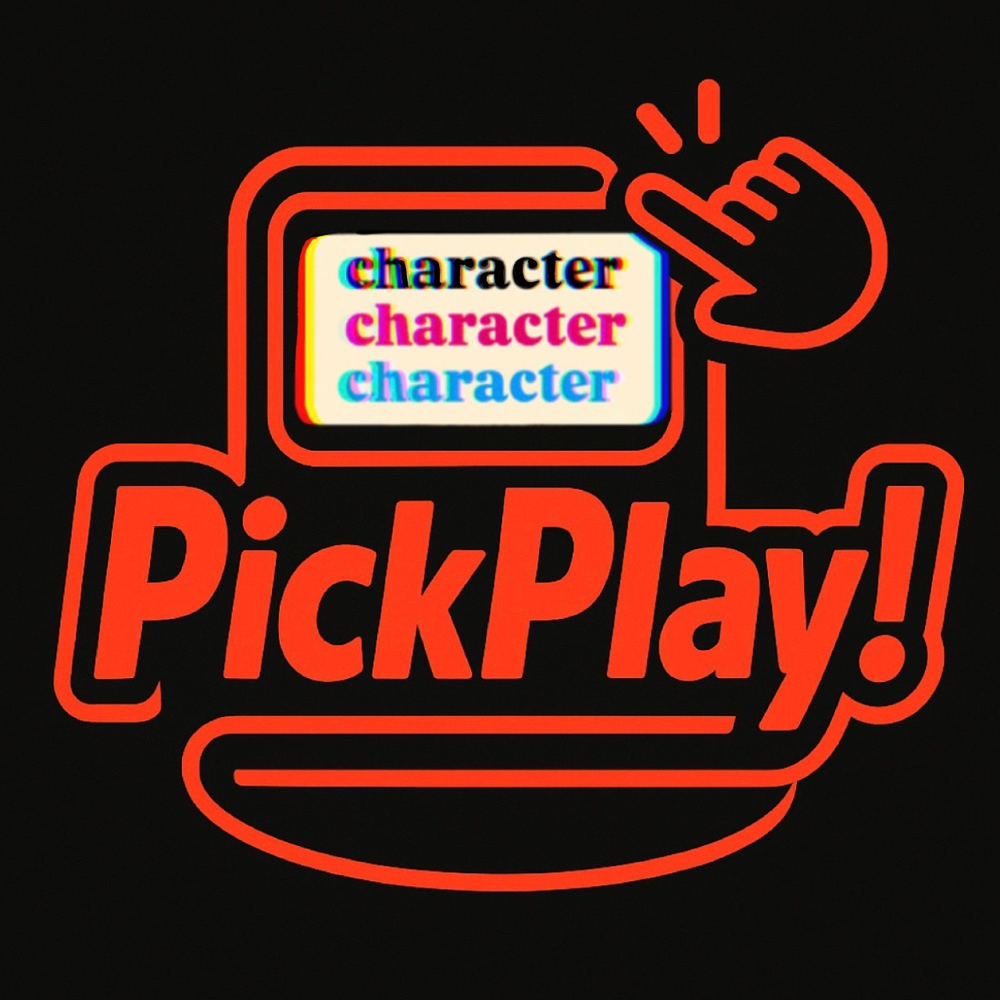

# PickPlay!

🎮 Random Character Selector


> 日本語のREADMEは [こちら](README.ja.md) をご覧ください。

## Overview

**PickPlay!** is a simple tool that randomly selects items from a list of candidates.

Use cases include:
- Roleplay games (FPS, RPG, TRPG, etc.): randomly assign roles such as Warrior, Mage, or Thief.
- Randomly generate scenarios, enemies, or character builds.
- Make fair character assignments among players.

## Background

When playing games with friends, we often struggled with decisions like “Which character should I use?” or “We always end up picking the same roles.”
To solve this, I built a lightweight web app that can randomly assign characters or options.

## Target Audience

Gamers and groups who enjoy cooperative or competitive games and want some variety or fairness in role assignments.

## 🌐 Public Page
The application is deployed using GitHub Pages.
▶️ [Open the app](https://black1000.github.io/PickPlay/)

### Example: Using Roles

1. Add roles (e.g., Tank, DPS, Healer), then input candidates (e.g., characters or skills) for each role.
2. Input player names.
3. Click the “Pick!” button — each role will be assigned randomly.
4. Results can be copied and shared on LINE or Discord.

### Example: Without Roles

1. Input candidates (e.g., characters) and player names directly.
2. Click “Pick!” to assign them randomly.
3. Copy and share the results via LINE or Discord.

> ⚠️ If the number of characters is fewer than the number of players, a warning message will be displayed and the pick will not proceed.

## MVP Features

- Random pick functionality using `Math.random()`
- Unlimited number of players
- Users can freely input candidates (comma- or line-separated)
- Supports managing candidates by “Role”
- Can also work without roles using a simple list
- Batch player input (via line breaks)
- Reset character lists with a single action
- Merge all characters registered under roles into one list
- Prevent duplicate role or character names (auto-remove or disallow)
- Copy results to LINE / Discord
- Persistent data saved in `localStorage`
- Language toggle: Japanese / English
- Flexible input handling (comma and newline support)

## Full Release Enhancements

- Responsive layout (mobile-friendly UI)
- Improved UX for duplicate name checks (clear error messages)
- Displays a warning if the number of characters is less than the number of players
- PWA Support(Added in June 2025): Installable as a web app from mobile home screens

### ✅ PWA Support (Added in June 2025): Use like an app from your home screen

## How to Use the PWA (Mobile & PC Supported)

### 1. Open the PWA site in your browser  
📍 App URL:  
[PickPlay!](https://black1000.github.io/PickPlay/)

---

### 2. How to Install

#### 📱 On Mobile

- **iPhone (Safari)**  
  Tap the share icon at the bottom → "Add to Home Screen" → Confirm the name and tap "Add"

- **Android (Chrome or similar)**  
  Tap the menu icon (three dots) at the top right → Select "Add to Home screen" or "Install"

---

### 3. After Installation

- An icon will appear on your home screen  
- Launching from the icon hides browser UI and makes it look like a standalone app  
- If cached properly, it can work offline (thanks to Service Worker)

---

### 4. 💻 How to Install on PC (Chrome / Edge)

1. Open the site in Chrome or Edge  
2. Look for the "Install" icon at the right end of the address bar  
3. If not visible, open the browser menu manually  
   - **Chrome:** Click menu (︙) → "Install [Site Name]"  
   - **Edge:** Click menu (…) → "Apps" → "Install this site as an app"  
4. Allow the install when prompted  
5. A desktop shortcut will be created, and the app will open in a separate window

---

### ⚠️ Notes

- Behavior may vary depending on browser or version  
- It may take a moment for caching to fully activate  
- Changes to the site’s URL structure may affect cached data  
- Chrome or Edge is recommended for desktop installation

---

## Planned Features (Future Roadmap)

- **PWA Support**: Installable as a web app from mobile home screens
- **Theme Toggle**: Light/Dark mode support
- **UI/UX Improvements**: Optimized layout and usability for mobile devices

## Technologies Used

PickPlay! is built entirely with front-end technologies — no backend or server required.

- Front-end: HTML, CSS, JavaScript
- Local storage via `localStorage`
- Random selection powered by JavaScript’s `Math.random()` and the Fisher-Yates shuffle algorithm:

```js
function shuffleArray(array) {
  for (let i = array.length - 1; i > 0; i--) {
    const j = Math.floor(Math.random() * (i + 1));
    [array[i], array[j]] = [array[j], array[i]];
  }
  return array;
}
